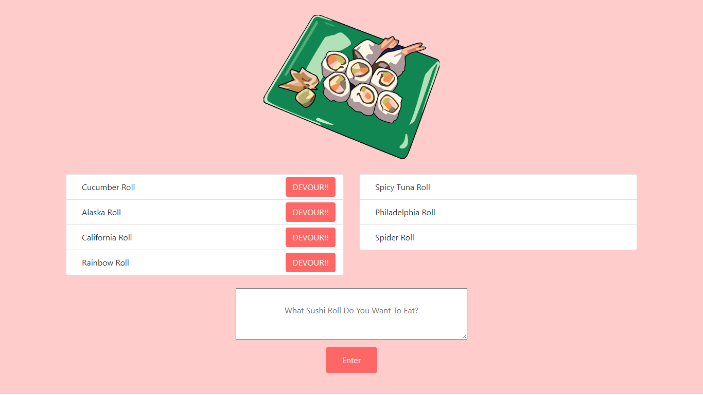

# Sushi-NEHM

https://sushi-express.herokuapp.com



A web application that utilizes Node.JS, Express.JS, Handlebars, and MySQL in order to provide a method of viewing sushi rolls that have yet to be eaten and sushi rolls that have been eaten.

### GETTING STARTED

#### BUILT-WITH

```

    Languages and Database :
    
    Javascript
    JQuery
    Handlebars
    Node
    Express
    HTML / CSS / Bootstrap
    MySQL

    Node Packages :
    
    body-parser : parse incoming request bodies in a middleware before your handlers, available under the req.body property
    express : fast, unopinionated, minimalist web framework for node
    express-handlebars : a Handlebars view engine for Express
    mysql : a node.js driver for mysql
    
```

#### INSTALLATION GUIDE

The following packages need to be installed using the following commands :

```
    npm install body-parser
    npm install express
    npm install express-handlebars
    npm install mysql
```

##### Sample Sushi Rolls Table and Queries

```sql
    /* Create and Use Database */
    DROP DATABASE IF EXISTS sushi_db;
    CREATE DATABASE sushi_db;
    USE sushi_db;

    /* Create sushi table */
    CREATE TABLE sushi 
    (
        id INTEGER(10) AUTO_INCREMENT NOT NULL,
        name VARCHAR(30),
        devoured boolean,
        primary key (id)
    );

    /* Test Queries to use */
    INSERT INTO sushi (name, devoured) VALUES ('Spicy Tuna Roll', true);

    INSERT INTO sushi (name, devoured) VALUES ('Cucumber Roll', false);

    INSERT INTO sushi (name, devoured) VALUES ('Philadelphia Roll', true);

    INSERT INTO sushi (name, devoured) VALUES ('Alaska Roll', false);

    INSERT INTO sushi (name, devoured) VALUES ('King Crab Roll', true);

    INSERT INTO sushi (name, devoured) VALUES ('Dragon Roll', true);

    INSERT INTO sushi (name, devoured) VALUES ('Boston Roll', true);

    INSERT INTO sushi (name, devoured) VALUES ('Shrimp Tempura Roll', true);

    INSERT INTO sushi (name, devoured) VALUES ('California Roll', false);

    INSERT INTO sushi (name, devoured) VALUES ('Rainbow Roll', false);

    INSERT INTO sushi (name, devoured) VALUES ('Spider Roll', true);
```

### WEBSITE AND IMAGES

#### Home Page

On this Home Page, individuals will have the opportunity to view a list of potential sushi rolls to be eaten as well as sushi rolls that have been eaten.


### TO-DO / BUGS
